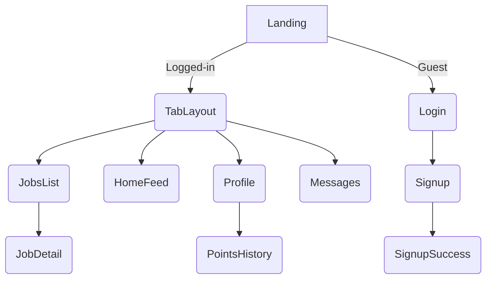

# Page / Route Catalogue

> Covers both existing and planned screens. Paths follow **Expo Router** conventions.

| Path | Screen Name | Description | TODO / Status |
|------|-------------|-------------|---------------|
| `/` | Landing / Home | Shown on first launch (unauthenticated) OR redirects to Tab layout when logged in. | Hook up data feed; decide auth guard logic. |
| `/login` | Login | Email/password sign-in. | Connect to Supabase auth & form validation. |
| `/signup` | Signup | Create new account. | Validation, error handling, password strength. |
| `/signup-success` | Signup Success | Confirmation & next steps (email verify). | Minor UI polish. |
| `/+not-found` | 404 | Fallback for unknown routes. | Styling only. |
| `/(tabs)` | Tab Layout | Container for bottom-tab navigation. | Needs final icons + badge counts. |
| `/(tabs)/index` | Home Feed | Displays top workers + prioritized job posts. | Connect `fetchHomeFeed`, add pull-to-refresh & infinite scroll. |
| `/(tabs)/jobs` | Jobs List | Browse open job posts. | Build filters/search; navigate to detail screen. |
| `/(tabs)/messages` | Messages | Inbox & chat threads. | Implement realtime chat UI & subscription. |
| `/(tabs)/profile` | Profile | User profile, points & rank display. | Add edit profile, PointsHistory, avatar upload. |
| *Planned* `/(tabs)/job/[id]` | Job Detail | Full description, apply actions, comments. | Create page & route params. |
| *Planned* `/(tabs)/points-history` | Points History | List of recent point activities. | Page scaffold; reuse `PointsHistory` component. |
| *Deprecated* `/app/**` | Old Router | Earlier copy of routes living at project root. | Delete once migration to `src/app` is complete. |

---

### Navigation Map

